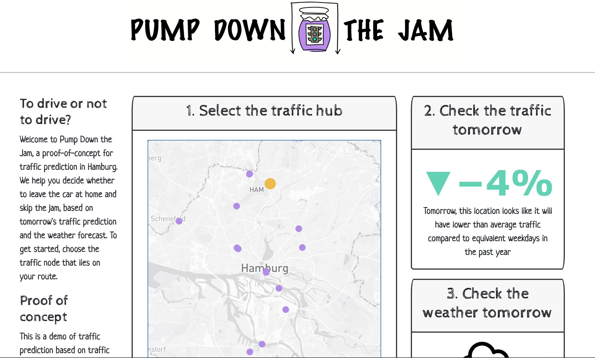

# Plotly Dash dashboard for Pump Up The Jam

This is the repo we used to create the dashboard on heroku for the project "Pump Down the Jam".

Access the live dashboard here: [https://pump-down-the-jam.herokuapp.com/](https://pump-down-the-jam.herokuapp.com/).

Find the full repo for the backend, including time-series-analysis with Prophet, here: https://github.com/SarahWiesner/as-green-as-it-gets

 
 
 

## What the dashboard does
The dashboard displays an interactive map for drivers to find predictions of traffic density for the following day. It also provides a simple weather forecast. Based on this information, drivers can decide whether or not to leave the car at home. The predicitons are based on our time-series prediction model, which uses past data to predict the next day's traffic density. In this demo, predictions are only available for March 2022, since predicitons of tomorrow's traffic would require automatic downloading of yesterday's traffic from the Hamburg Geoportal website, and this is currently not possible.

The weather forecast is an up-to-date weather forecast based on the Deutscher Wetterdienst and parsed by 
@FL550's [simple_dwd_weatherforecast](https://github.com/FL550/simple_dwd_weatherforecast).

## Run the dashboard locally

1. Install, if necessary, python version 3.11.2
- `$ pyenv install 3.11.2`

2. Set up the dashboard virtual environment and activate it with 
- ` $ make setup`
- `$ source .venv/bin/activate`

2. You will need your own Mapbox key saved as 
`MAP_BOX_KEY="your key"` 
in a `.env` file locally, otherwise the dashboard will throw an error when it tries to load the map of Hamburg. Get your key here: [https://www.mapbox.com/](https://www.mapbox.com/). You will have to store payment details, but there are currently no costs unless you exceed many thousands of map requests per month.
4. Load the Dashboard locally with
- ` $ gunicorn app:server`

You will be provided with a local link to access the dashboard in your web browser.

## What is in this repository

| File                          |                                                         |
| ----------------------------- | ------------------------------------------------------- |
| app.py                        | Python file which contains the dashboard for deployment. Feel free to modify it.|
| Procfile                      | Needed by Heroku to know how to run the app.   |
| runtime.txt                   | Required for deployment, to specify a python version.    |
| assets                        | Folder containing png images for the dashboard    |
| requirements.txt              | These are the libraries needed by the app on heroku and to run things locally            |
|  Dauerzaehlstellen_latlon.csv | Contains the lat-lon position, name and alias of each traffic density counting stations     |
|  pred_station_date.pkl        | The predictions for available stations for every day in March 2022, with comparison to similar days in last year. Use the pandas library to read the pickle file with `pd.read_pickle()`|
